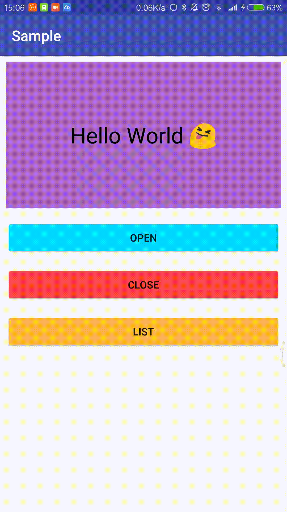

# SlipperyLayout


这是一款提供侧滑功能的 ViewGroup，可以设置它的滑动方向：左、右、上、下。
另外，它也解决了滑动冲突的问题，所以你可以把它放在你的 RecyclerView 或者 ListView 中。

## 预览



[Demo 点此下载](apk/sample.apk)

## 依赖


## 用法

添加到你的布局文件中：

```java
<com.juhezi.slipperylayout.SlipperyLayout
        android:id="@+id/sl_test"
        android:layout_width="match_parent"
        android:layout_height="200dp"
        android:layout_margin="8dp"
        app:content="@layout/content"
        app:lock="false"
        app:menu="@layout/menu"
        app:slideGravity="top" />
```

提供的属性：

* content：内容布局的引用

* menu：菜单布局的引用

* slideGravity：滑动方向（左、右、上、下）

* lock：是否锁定滑动

可以在代码中控制 SlipperyLayout 的打开或者关闭

```java
SlipperyLayout mSlTest = (SlipperyLayout) findViewById(R.id.sl_test);
Button mBtnOpen = (Button) findViewById(R.id.btn_open);
Button mBtnClose = (Button) findViewById(R.id.btn_close);
mBtnOpen.setOnClickListener(new View.OnClickListener() {
    @Override
    public void onClick(View v) {
        mSlTest.openMenuView();   //打开菜单视图
    }
});
mBtnClose.setOnClickListener(new View.OnClickListener() {
    @Override
    public void onClick(View v) {
        mSlTest.closeMenuView();  //关闭菜单视图
    }
});
```

提供的方法：

* `public void setSlideGravity(@SlideGravity int slideGravity)`，设置滑动方向

* `public boolean isLock()`，是否锁定滑动

* `public void setLock(boolean lock)`，设置锁定（设置为 true 的话，SlipperyLayout 就无法进行滑动）

* `public boolean isMenuViewVisible()`，获取菜单视图的可见性

* `public View getMenuView()`，获取菜单视图

* `public View getContentView()`，获取内容视图

* `public void openMenuView()`，打开菜单视图

* `public void closeMenuView()`，关闭菜单视图

## 注意

SlipperyLayout 支持 Padding 和 Margin，但是不支持 elevation。

如果你在使用过程中遇到了什么问题，请发 issue 或者发邮件给我，我的邮箱是 juhezix@163.com。
